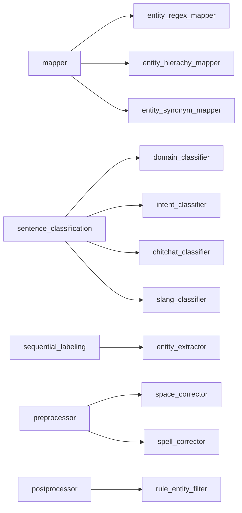

# nlu_flow
NLU model workFlow for business-chatbot

## Module Architecture

```mermaid
graph LR
  A[mapper] --> AA[entity_regex_mapper]
  A --> AB[entity_hierachy_mapper]
  A --> AC[entity_synonym_mapper]
  
  B[sentence_classification] --> BA[domain_classifier]
  B[sentence_classification] --> BB[intent_classifier]
  B[sentence_classification] --> BC[chitchat_classifier]
  B[sentence_classification] --> BD[slang_classifier]
  
  C[sequential_labeling] --> CA[entity_extractor]
  
  D[preprocessor] --> DA[space_corrector]
  D[preprocessor] --> DB[spell_corrector]
  
  E[postprocessor] --> EA[rule_entity_filter]
 
```
