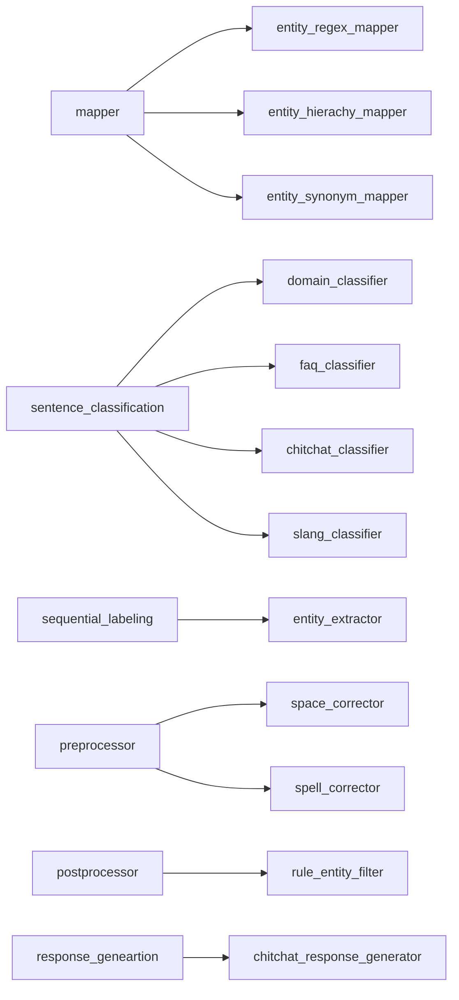

# nlu_flow
NLU model workFlow for business-chatbot

## Module Architecture

## Reference
[strapi](https://strapi.io/)
[KoGPT2](https://github.com/SKT-AI/KoGPT2)
[ludwig](https://github.com/uber/ludwig)

